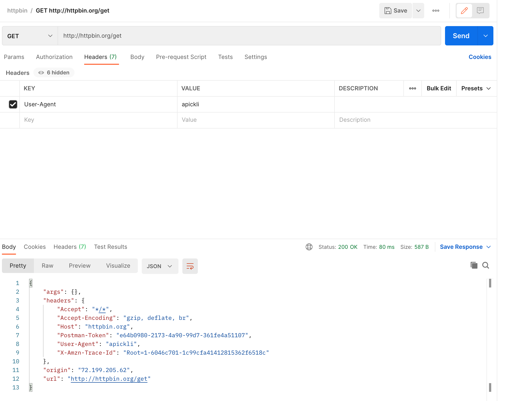

# Apickli Demo

## Source
https://github.com/apickli/apickli/

## Notes
Apickli relies on a [deprecated version](https://www.npmjs.com/package/cucumber) of `cucumber-js`. I opted to use the [latest version](https://www.npmjs.com/package/@cucumber/cucumber), which meant I had to change the require lines mentioned in `apickli` documentation).

## Changes 
The following is a modified version of `apickli`'s simple tutorial and outlines the steps I took to create this project to run some integration tests.

### Start a new project

#### 1. Folder structure
Let's start a new integration testing project for an API called myapi. The folder structure will need to match the structure expected by cucumber-js:

```
myapi/
---- test/
--------- features/
--------------  step_definitions/
--------------------  apickli-gherkin.js
--------------  support/
-------------------- init.js
--------------  myapi.feature
---- package.json
```

The `features` directory contains cucumber feature files written in gherkin syntax. `step_definitions` contains the JavaScript implementation of gherkin test cases. Check out the [GitHub repository](https://github.com/apickli/apickli/) for example implementations covering most used testing scenarios.

#### 2. package.json

This can be an example package.json file for our project:

```
{
	"name": "myapi-test",
	"version": "1.0.0",
	"description": "Integration testing for myapi v1",
	"dependencies": {
		"apickli": "latest"
	},
    	"devDependencies": {
		"@cucumber/cucumber": "^7.0.0"
	}
}
```

#### 3. Install dependencies

With our `package.json` file defined, we can now install project dependencies by running the following command line in the root directory of our project:

```
$ npm install
```

This will install the apickli and cucumber-js modules to node_modules. In order to use the current cucumber-js package, you must change the following line in `node_modules/apickli/apickli.js`:

```
const {Before, Given, When, Then} = require('/cucumber');
```

to this:

```
const {Before, Given, When, Then} = require('@cucumber/cucumber');
```

#### 4. Scenario definitions

We can define features and scenarios in `.scenario` files. Enter the following in `test/features/myapi.feature`

```
Feature:
	Httpbin.org exposes various resources for HTTP request testing
	As Httpbin client I want to verify that all API resources are working as they should

	Scenario: Setting headers in GET request
		Given I set User-Agent header to apickli
		When I GET /get
		Then response body path $.headers.User-Agent should be apickli
```


For more examples of feature and scenario definitions, check out the [test folder](https://github.com/apickli/apickli/blob/master/source/test) in the apickli project repo.

#### 5. Get apickli-gherkin steps

We now need the corresponding step definitions that implement the steps in our scenario. Apickli has a collection of steps already implemented - ready to be included in your project - see [gherkin expressions](https://github.com/apickli/apickli/#gherkin-expressions).

The simplest way to adopt these expressions is to create a file named `apickli-gherkin.js` in `features/step_definitions` and import the `apickli/gherkin.js` module that we installed in step 3.

Add the following to `test/features/step_definitions/apickli-gherkin.js`:

```
module.exports = require('apickli/apickli-gherkin');
```

#### 6. Support code

Now we need a support code to implement cucumber hooks and initialize `apickli`. Add the following in `test/features/support/init.js`:

```
'use strict';

const apickli = require('apickli');
const {Before} = require('@cucumber/cucumber');

Before(function() {
    this.apickli = new apickli.Apickli('http', 'httpbin.org');
    this.apickli.addRequestHeader('Cache-Control', 'no-cache');
});
```

#### 6. Run tests with cucumber-js

From the project's root directory, run the scenario with the following command:

```
$ ./node_modules/.bin/cucumber-js test/features/myapi.feature

```

This will test the scenario and output the following:

```
1 scenario (1 passed)
3 steps (3 passed)
```

This is the result of our test of the scenario defined in `test/features/myapi.feature`:

```
Feature:
	Httpbin.org exposes various resources for HTTP request testing
	As Httpbin client I want to verify that all API resources are working as they should

	Scenario: Setting headers in GET request
		Given I set User-Agent header to apickli
		When I GET /get
		Then response body path $.headers.User-Agent should be apickli
```

Which shows that are scenario (comprised of 3 steps) indeed passes, which is consistent with the following test performed with `Postman`:

